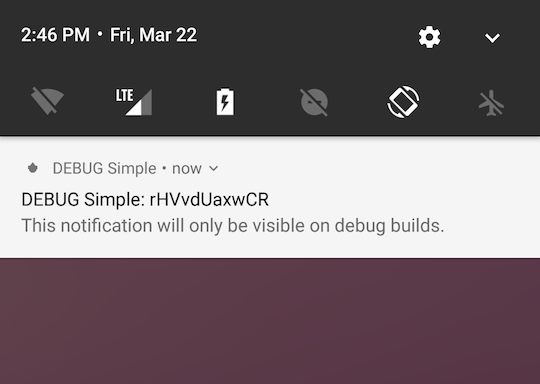

# Quirks That You Should Probably Be Aware Of

### Syncing of data using WorkManager

[WorkManager](https://developer.android.com/topic/libraries/architecture/workmanager) is used for scheduling periodic syncing of patient-related data like blood pressures, prescribed medicines, and demographic information. For debugging the state of the jobs, use this command:

```
adb shell dumpsys jobscheduler | grep org.simple.clinic
```

### Android tests

When compiling the project using Android Studio's `Make Project` option, it may not build files or run annotation processors inside the `androidTest` package. This can cause confusion when changes are made to Android tests. As a workaround, `androidTest` can be compiled from the command line manually,

```
./gradlew assembleAndroidTest
```

### Dev Environment

#### 1. Verifying a new user account with SMS code

During development, the QA server environment defaults to using `000000` as the SMS verification code for logging into the app. This means, you can use any phone number to sign into the dev environment.

The app also tries to auto-read the OTP if an SMS is received in the format,

```
<#> 000000 is your Simple Verification Code
{app signature}
``` 

The [app signature](https://developers.google.com/identity/sms-retriever/verify#computing_your_apps_hash_string) can be found in the debug notification's title:



For other build environments, see [this doc](how-to-generate-an-app-sms-signature.md) for instructions on computing an app signature.

#### 2. Approval for new user accounts

Unlike other environments (staging, QA, and production), users registering on the dev environment are auto-approved when they register.
