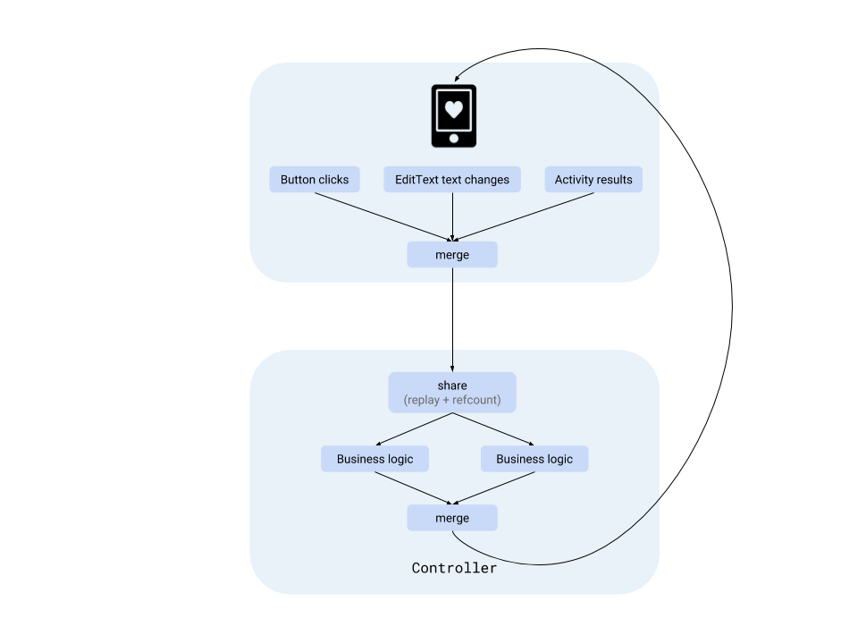

# ADR 001: Screen Controllers

## Status

Superceded by [008](./008-screen-architecture-v3.md) on 2019-10-01

## Context

We don’t want to put business logic inside Android framework classes (like an `Activity` or `Fragment`) because those cannot be unit tested. To enable
a fast feedback loop (i.e. tests that run on the JVM and not Android VM), we separate screens and controllers using
the [MVI architecture](https://medium.com/@ragunathjawahar/mvi-series-a-pragmatic-reactive-architecture-for-android-87ca176387d1) [pattern](https://medium.com/@ragunathjawahar/mvi-series-a-pragmatic-reactive-architecture-for-android-87ca176387d1)
.

## Decision

Every screen has one controller that consumes user events, performs business logic with the help of data repositories and communicates UI changes back
to the screen.

User interactions happening on the screen are abstracted inside data classes of type `UiEvent`. These events flow to the controller in the form of
RxJava streams.

```kotlin
// Create the UsernameTextChanged event by listening to the EditText
RxTextView
  .textChanges(usernameEditText)
  .map { text -> UsernameTextChanged(text) }

// Event
data class UsernameTextChanged(text: String) : UiEvent
```

The screen sends a single stream of `UiEvent`s to the controller and gets back a transformed stream of UI changes. The flow of data is
uni-directional. To merge multiple streams into one, RxJava’s `merge()`  operator is used.

```kotlin
// Login screen
Observable.merge(usernameChanges(), passwordChanges(), submitClicks())
  .compose(controller)
  .takeUntil(screenDestroy)
  .subscribe { uiChange -> uiChange(this) }
```

In the controller, `UiEvent`s are transformed as per the business logic and `UiChange`s are sent back to the screen. The `UiChange` is a simple lambda
function that takes the screen itself as an argument, which can call a method implemented by the screen interface.

```kotlin
typealias Ui = LoginScreen
typealias UiChange = (LoginScreen) -> Unit

class LoginScreenController : ObservableTransformer<UiEvent, UiChange>() {

  fun apply(events: Observable<UiEvent>): Observable<UiChange> {
    events.ofType<UsernameTextChanged>
      .map { isValidUsername(it.text) }
      .map { isValid ->
          { ui: Ui -> ui.setSubmitButtonEnabled(isValid) } // UiChange lambda!
      }
  }
}
```

When the events have to observed across multiple functions in the controller, the stream is shared using `replay()` + `refCount()` so that the UI
events aren't recreated once for every subscription. `replay()` shares a single subscription to the screen by replaying the events to every observer
and `refCount()` keeps the subscription alive as long as there is at least one observer.

```kotlin
class LoginScreenController : ObservableTransformer<UiEvent, UiChange>() {

  fun apply(events: Observable<UiEvent>): Observable<UiChange> {
    val replayedEvents = events.replay().refCount()
    
    return Observable.merge(
        enableSubmitButton(replayedEvents),
        loginUser(replayedEvents))
  }

  fun enableSubmitButton(events: Observable<UiEvent>): Observable<UiChange>()

  fun loginOnSubmit(events: Observable<UiEvent>): Observable<UiChange>()
}
```



([diagram source](https://docs.google.com/drawings/d/1I_VdUM8Pf9O3nOYViqVF6kiyqFaYFD2fHmKRyvwmEl4/edit?usp=sharing))

## Consequences

Because all events are replayed from the beginning on subscription, `UiChange` functions must only subscribe to events exactly once, and immediately
when the controller is constructed.

For instance, subscribing to the event stream in a `flatMap` will result in the events getting replayed every time `flatMap`'s upstream emits:

```kotlin
// Incorrect
fun loginOnSubmit(events: Observable<UiEvent>): Observable<UiChange>() {
  val usernameChanges = events
      .ofType<UsernameTextChanged>()
      .map { it.text }

  val submitClicks = events.ofType<SubmitClicked>()

  return submitClicks
    .flatMap { usernameChanges.take(1) }  // culprit!
    .flatMap { username ->
      // The username text here will always be the first
      // text entered by the user and not the latest one.
      loginUser(username)
    }
}
```

Here’s what the correct way would look like, and care must be taken while writing code in the controller:

```kotlin
// Correct
fun loginOnSubmit(events: Observable<UiEvent>): Observable<UiChange>() {
  val usernameChanges = events
    .ofType<UsernameTextChanged>()
    .map { it.text }

  val submitClicks = events.ofType<SubmitClicked>()

  return submitClicks
    .withLatestFrom(usernameChanges) // works!
    .flatMap { username -> loginUser(username) }
}
```
