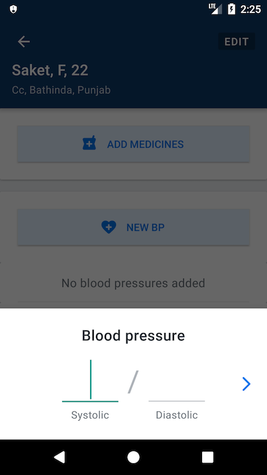
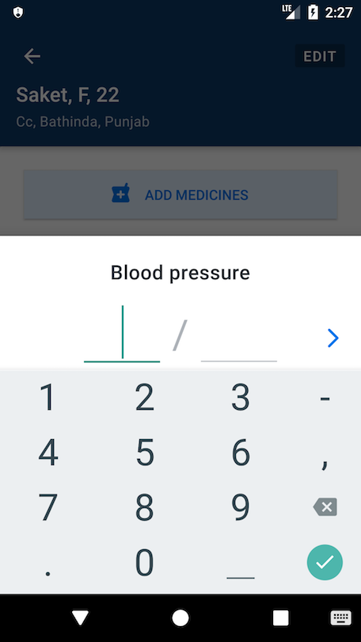
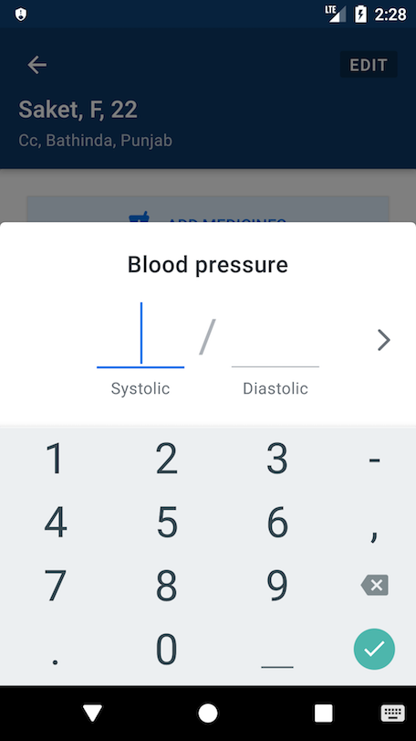

# ADR 002: Using Activity for bottom sheets instead of Fragment

## Status

Superceded by [011](./011-screen-navigation-v2.md) on 2020-01-12.

## Context

For displaying non-persistent bottom sheets, [Material.io](https://material.io/develop/android/components/bottom-sheet-dialog-fragment/) recommends
using BottomSheetDialogFragment. Unfortunately it doesn’t play very nicely with the on-screen keyboard when the sheet includes input text fields. When
the on-screen keyboard is shown, it aligns itself with the bottom edge of the field. Everything beneath the focused text field gets covered by the
keyboard.

This is standard behavior of the on-screen keyboard, but Activities have worked around this by panning or resizing the layout whenever the keyboard is
shown. For some reason, changing the softInputMode on the dialog doesn’t have any affect on dialogs.

To be able to align the entire sheet above the keyboard, an Activity called BottomSheetActivity is used instead of BottomSheetDialogFragment that
mimics a modal sheet with a translucent background.

# Consequences

`BottomSheetActivity` doesn’t support drag-to-dismissing. We could
use [BottomSheetBehavior](https://developer.android.com/reference/android/support/design/widget/BottomSheetBehavior) in the future to add support for
it.
